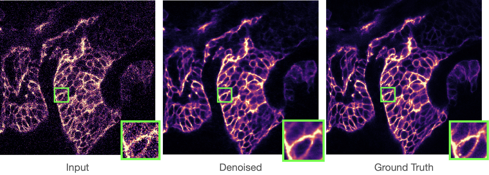

# Self-Supervised Poisson-Gaussian Denoising

Code for our paper [Self-Supervised Poisson-Gaussian Denoising](http://arxiv.org/abs/2002.09558), to appear at WACV 2021.

Wesley Khademi, Sonia Rao, Clare Minnerath, Guy Hagen and [Jonathan Ventura](https://jonathanventura.github.io).  [Self-Supervised Poisson-Gaussian Denoising](http://arxiv.org/abs/2002.09558).  IEEE Winter Conference on Applications of Computer Vision (WACV) 2021 (to appear).

The code is set up to train and test on the [Fluorescence Microscopy Dataset](http://github.com/bmmi/denoising-fluorescence) but could be easily adapted to other data.

### Abstract

We extend the blindspot model for self-supervised denoising to handle Poisson-Gaussian noise and introduce an improved training scheme that avoids hyperparameters and adapts the denoiser to the test data. Self-supervised models for denoising learn to denoise from only noisy data and do not require corresponding clean images, which are difficult or impossible to acquire in some application areas of interest such as low-light microscopy. We introduce a new training strategy to handle Poisson-Gaussian noise which is the standard noise model for microscope images. Our new strategy eliminates hyperparameters from the loss function, which is important in a self-supervised regime where no ground truth data is available to guide hyperparameter tuning. We show how our denoiser can be adapted to the test data to improve performance. Our evaluations on microscope image denoising benchmarks validate our approach.

# Dependencies

* Python 3
* Tensorflow
* scikit-image
* tqdm

# Dataset download

    bash download_fmd.sh

# Training

To train various models on the Confocal Mice dataset:

    python train_fmd.py --path ./dataset --dataset Confocal_MICE --mode uncalib ;
    python train_fmd.py --path ./dataset --dataset Confocal_MICE --mode poissongaussian --reg 1 ;

To test the trained models:

    python test_fmd.py --path ./dataset --dataset Confocal_MICE --mode uncalib ; 
    python test_fmd.py --path ./dataset --dataset Confocal_MICE --mode poissongaussian --reg 1 ; 

